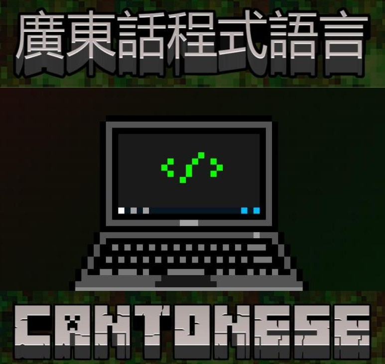
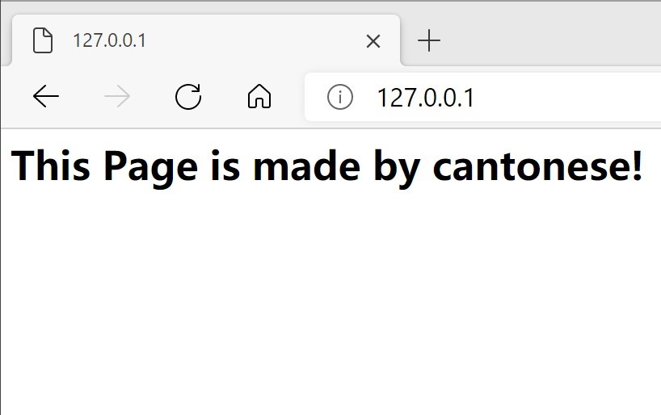

  
### Read this in other languages: [English](README-en.md)  
# 粤语编程语言
如果你不会粤语或编程，请看[5分钟边学编程边学粤语](doc/cantonese.md)  
# 目录
<a href="#0">引言</a>  
<a href="#1">咋咋淋入门</a>  
&emsp;&emsp;<a href="#2">Hello World</a>  
&emsp;&emsp;<a href="#3">赋值语句 </a>  
&emsp;&emsp;<a href="#4">睇下变量嘅类型</a>  
&emsp;&emsp;<a href="#5">循环</a>  
&emsp;&emsp;<a href="#6">条件语句</a>  
&emsp;&emsp;<a href="#7">函数</a>  
&emsp;&emsp;<a href="#8">抛出异常</a>  
&emsp;&emsp;<a href="#9">断言语句</a>  
&emsp;&emsp;<a href="#10">错误捕捉语句</a>  
&emsp;&emsp;<a href="#11">调用Python库</a>  
&emsp;&emsp;<a href="#12">面向对象编程</a>  
&emsp;&emsp;<a href="#13">栈嘅使用</a>  
<a href="#14">更多例子</a>  
&emsp;&emsp;<a href="#15">睇睇时间</a>  
&emsp;&emsp;<a href="#16">暂停</a>  
&emsp;&emsp;<a href="#17">嚟个随机数</a>  
&emsp;&emsp;<a href="#18">计算相关系数</a>  
&emsp;&emsp;<a href="#19">仲可以机器学习?</a>  
&emsp;&emsp;<a href="#20">海龟画图</a>  
&emsp;&emsp;<a href="#21">迷宫游戏仔</a>  
&emsp;&emsp;<a href="#22">各种排序同埋查找算法</a>  
&emsp;&emsp;<a href="#23">写个网页来睇下?</a>   
&emsp;&emsp;<a href="#24">用粤语开发一个App</a>   
<a href="#25">点样运行?</a>  
<a href="#26">TODOs</a>  
# <a name="0">引言</a>
粤语编程语言系咩? 佢系一门用粤语嚟同计算机沟通嘅编程语言。  
喺呢个语言度，计算机可以读明你写嘅粤语。所以话，你可以用粤语嚟操作(虐待)计算机。

# <a name="1">咋咋淋入门</a>
### <a name="2">Hello World</a>
用粤语写嘅第一个程序Hello World:  
```
畀我睇下 " Hello World! " 点样先?
```
### <a name="3">赋值语句 </a>
```
讲嘢 |A| 系 1
讲嘢 |B| 系 2
```
### <a name="4">睇下变量嘅类型</a>
```
讲嘢 |A| 系 1
起底: |A|
```
运行结果:  
```
<class 'int'>
```
### <a name="5">循环</a>
打印从1到100:  
```
讲嘢: |start| 系 0
讲嘢: |结束| 系 唔啱
落操场玩跑步
    讲嘢: |start| 系 |start + 1|
    畀我睇下 |start| 点样先?
    如果 |start >= 100| 嘅话 -> {
        饮茶先啦
    }
玩到 |结束| 为止
收工
```
当然用`For`循环都得:  
```
|A| 从 1 行到 100
    畀我睇下 |A| 点样先?
行晒
```
### <a name="6">条件语句</a>
```
讲嘢: |A| 系 2
如果 |A 系 2| 嘅话 -> {
    畀我睇下 "A 系 2" 点样先?
}
唔系 嘅话 -> {
    畀我睇下 "A 唔系 2" 点样先?
}
```
### <a name="7">函数</a>
用 Cantonese 实现嘅阶乘:  
```
$factorial |项数| 要做咩:
    如果 |项数 系 0| 嘅话 -> {
        还数 1
    }
    唔系 嘅话 -> {
        还数 |factorial(项数 减 1) 乘 项数|
    }
搞掂
```  
返回最大值:  
```
$get_max |数字1, 数字2| 要做咩:
    如果 |数字1 比唔上 数字2| 嘅话 -> {
        还数 |数字2|
    }
    唔系 嘅话 -> {
        还数 |数字1|
    }
搞掂
```
调用函数:  
```
用下 |get_max(23, 17)|
```
### <a name="8">抛出异常</a>
```
掟个 |ImportError| 来睇下?
```
运行结果:
```
濑嘢: ImportError()!
```
### <a name="9">断言语句</a>
```
谂下: |1 + 1 == 3| ?
```  
运行结果:  
```
濑嘢: AssertionError()!
```
### <a name="10">错误捕捉语句</a>
try-except-finally:  
```
执嘢 -> {
    讲嘢: |A| 系 |B|
}
揾到 |NameError| 嘅话 -> {
    畀我睇下 "揾到NameError" 点样先？
}
执手尾 -> {
    畀我睇下 "执手尾" 点样先？
    讲嘢: |A| 系 1
    讲嘢: |B| 系 1
    畀我睇下 |A, B| 点样先？
}
``` 
### <a name="11">调用 Python 库</a>
```
使下 os
使下 math
```
### <a name="12">面向对象编程</a>
声明对象`duck`, 继承至`object`, 分别有两个方法`游水`同埋`睡觉`, 仲有一个属性`性别`:  
```
咩系 |duck|?
    佢个老豆叫 |object|
    佢嘅 |性别| 系 "公"
    佢识得 |游水| -> {
        畀我睇下 "Duck is swimming" 点样先？
    }
    佢识得 |睡觉| -> {
        畀我睇下 "Duck is sleeping" 点样先？
    }
明白未啊?
```  
调用类中嘅方法:  
```
|duck()| -> |游水|: ||
|duck()| -> |睡觉|: ||
```
运行结果:  
```
Duck is swimming
Duck is sleeping
```
### <a name="13">栈嘅使用</a>
```
有条仆街叫 |Deo哥|
顶你 -> |Deo哥|: 1
顶你 -> |Deo哥|: 2
顶你 -> |Deo哥|: 3
丢你 -> |Deo哥|
```
运行结果:  
```
Stack: [1,2]
```
# <a name="14">更多例子</a>
### <a name="15">显示当前时间</a>
```
使下 datetime
畀我睇下 |宜家几点()| 点样先？
```
运行结果:  
```
2021-01-17 09:16:20.767191
```
### <a name="16">暂停</a>
```
瞓阵先 /* 暂停2s */
瞓 5s /* 暂停5s */
```  
### <a name="17">嚟个随机数</a>
```
使下 random
讲嘢: |A| 就 |求其啦()|
```
运行结果:  
```
0.15008236307867207
```  
### <a name="18">计算相关系数</a>
声明两个list, 计算相关系数:  
```
使下 math
|2.165, 1.688, 1.651, 2.229| 拍住上 -> |A|
|2.060, 1.822, 1.834, 2.799| 拍住上 -> |B|
畀我睇下 |A同B有几衬| 点样先？
```
运行结果:  
```
0.8066499427138474
```
### <a name="19">仲可以机器学习?</a>
实现KNN算法:
```
使下 math
|[5, 1], [4, 0], [1, 3], [0, 4]| 拍住上 -> |数据|
|'动作片', '动作片', '科幻片', '科幻片'| 拍住上 -> |标签|
讲嘢: |K| 系 3
嗌 KNN 过嚟估下 -> |[3, 0]|
```
运行结果:
```
动作片
```
线性回归:
```
使下 math
|300.0 , 400.0 , 400.0 , 550.0 , 720.0 , 850.0 , 900.0 , 950.0| 拍住上 -> |X|
|300.0 , 350.0 , 490.0 , 500.0 , 600.0 , 610.0 , 700.0 , 660.0| 拍住上 -> |Y|
嗌 L_REG 过嚟估下 -> |900.0|
```
运行结果:
```
Linear function is:
y=0.530960991635149x+189.75347155122432
667.6183640228585
```
### <a name="20">海龟绘图</a>
```
老作一下 -> {
    首先: |画个圈(100)|
    跟住: |写隻字("Made By Cantonese\n")|
    最尾: |听我支笛()|
}
```  
运行结果:    
  

### <a name="21">迷宫游戏仔</a>
[代码](examples/games/game.cantonese)  
运行结果:  


### <a name="22">各种排序同埋查找算法</a>
* [二分查找](examples/algorithms/binary_search.cantonese)
* [线性查找](examples/algorithms/linear_search.cantonese)
* [冒泡排序](examples/algorithms/bubble_sort.cantonese)
* [插入排序](examples/algorithms/insert_sort.cantonese)

### <a name="23">写个网页睇下</a>
一个简单嘅网页:
```
老作一下 {
    写标题 => [ "我嘅第一个网页" ]
    写隻字 => [ "Hello World" ]
}
```
运行后, 打开`127.0.0.1:80`可查看运行结果:  
```
python src/cantonese.py ../examples/web/hello_web.cantonese -to_web 
```


### <a href="#24">用粤语开发一个App</a>
首先安装`kivy`:
```
pip install kivy
```
第一个App`HelloWord`:  
```
使下 kivy
咩系 HelloApp?
    佢个老豆叫 App
    佢识得 |HelloWorld| -> {
        |同我show| 下 -> "Hello World" @ |做嘢|
        还数 |做嘢|
    }
明白未啊?

|App运行| 下 -> |HelloApp, HelloApp().HelloWorld|
```
  

# 仲有啲咩?

[喺呢度](examples/)睇下更多例子.  

# <a name="25">点样运行?</a>
Cantonese 可以用多种方式运行, 用自己嘅虚拟机, 或者翻译成python同html都得!
使用虚拟机执行(仅支持部分语句):   
```shell
python src/cantonese.py [-文件名] -stack_vm
```
查看生产的指令:  
```
python src/cantonese.py [-文件名] -stack_vm -debug
```
用Python虚拟机运行(环境净系支持 Python3，因为噉先符合广东人先进嘅思想!):   
```shell
python src/cantonese.py [-文件名]
```
将 Cantonese 转化成 Python:
```shell
python src/cantonese.py [文件名] -to_py
```
例如:  
```
python src/cantonese.py examples/basic/helloworld.cantonese -to_py
```
运行嘅结果系:  
```
print(" Hello World! ")
exit()
```
生成`HTML`:  
```shell
python src/cantonese.py examples/web/web_hello.cantonese -to_web -compile
```
```html
<html>
<head>
<meta charset="utf-8" />
</head>
<title>我嘅第一个网页</title>
<h1>Hello World</h1>
</html>
```
用繁体字运行:
```
python src/cantonese.py [文件名] -use_tr
```  
Vscode插件:https://github.com/Cantonese-community/vscode-cantonese  

# <a name="26">TODOs</a>
本项目代码写得很陋(烂)，欢迎各个粤语同埋编程爱好者一齐讨论同贡献！为粤语文化遗产嘅保护贡献出自己嘅一份力量！
今后要做咩:  
* 完善语法错误检查
* 加多啲语句
* 完善自己嘅虚拟机
